# C6 — Content prerequisites map

Generated: 2026-08-27 (from `pythonCurriculum.js`, `robloxCurriculum.js`, `aiAtWorkCurriculum.js`).

## Verdict

| Course | Lessons | Missing refs | Cycles | Later-module prereqs | Mid-course orphans (empty prereqs after lesson 1) |
|---|---:|---:|---:|---:|---:|
| Python | 84 | 0 | 0 | 0 | 0 |
| Roblox | 92 | 0 | 0 | 0 | **11** (each module-02…12 opener) |
| AI at Work | 28 | 0 | 0 | 0 | 0 |

Unlock runtime note: `courseLessonAccess.js` drips lessons by **curriculum order**, not by the prerequisites graph. Prerequisites still matter for authoring consistency and `courseContent.test.mjs` (which prefers content-file prereqs when present).

## Sample diagram — Python modules 00–02

Linear chain: each lesson requires the previous one; module boundaries are bridged (`lesson-00-8` → `lesson-01-1` → … → `lesson-02-1`).

```mermaid
flowchart TD
  lesson_00_1["00-1"]
  lesson_00_2["00-2"]
  lesson_00_3["00-3"]
  lesson_00_4["00-4"]
  lesson_00_5["00-5"]
  lesson_00_6["00-6"]
  lesson_00_7["00-7"]
  lesson_00_8["00-8"]
  lesson_01_1["01-1"]
  lesson_01_2["01-2"]
  lesson_01_3["01-3"]
  lesson_02_1["02-1"]
  lesson_02_2["02-2"]
  lesson_02_3["02-3"]
  lesson_02_4["02-4"]
  lesson_02_5["02-5"]
  lesson_02_6["02-6"]
  lesson_02_7["02-7"]
  lesson_02_8["02-8"]
  lesson_00_1 --> lesson_00_2
  lesson_00_2 --> lesson_00_3
  lesson_00_3 --> lesson_00_4
  lesson_00_4 --> lesson_00_5
  lesson_00_5 --> lesson_00_6
  lesson_00_6 --> lesson_00_7
  lesson_00_7 --> lesson_00_8
  lesson_00_8 --> lesson_01_1
  lesson_01_1 --> lesson_01_2
  lesson_01_2 --> lesson_01_3
  lesson_01_3 --> lesson_02_1
  lesson_02_1 --> lesson_02_2
  lesson_02_2 --> lesson_02_3
  lesson_02_3 --> lesson_02_4
  lesson_02_4 --> lesson_02_5
  lesson_02_5 --> lesson_02_6
  lesson_02_6 --> lesson_02_7
  lesson_02_7 --> lesson_02_8
```

## Graph integrity

- **Missing refs:** none across all three curricula (every prerequisite ID exists in the same course).
- **Cycles:** none (DFS coloring over curriculum prerequisites).
- **Later-module prereqs:** none (no lesson depends on a lesson from a higher `module.order`).

### Python branch quirk (not a cycle / not later-module)

In **curriculum**, `lesson-09-3` (Scraping Websites) lists `prerequisites: ["lesson-09-1"]`, skipping `lesson-09-2` (BeautifulSoup). `lesson-09-4` then requires `lesson-09-3`. So `lesson-09-2` is reachable but not on the curriculum path to module 10.

**Content file differs:** `lesson-09-3.js` has `prerequisites: ["lesson-09-2"]`. See Recommended fixes.

## Mid-course orphans

### Python

Only `lesson-00-1` has empty prerequisites. No mid-course orphans.

### AI at Work

Only `ai-lesson-00-1` has empty prerequisites. Module bridges are wired (e.g. `ai-lesson-00-4` → `ai-lesson-01-1`). No mid-course orphans.

### Roblox (suspicious)

Within each module, lessons form a linear chain. **Module openers 02–12 have `prerequisites: []`**, so they do not require the previous module checkpoint:

| Module opener | Suggested bridge (previous last lesson) |
|---|---|
| `lesson-roblox-2-1` | `lesson-roblox-1-8` |
| `lesson-roblox-3-1` | `lesson-roblox-2-4` |
| `lesson-roblox-4-1` | `lesson-roblox-3-8` |
| `lesson-roblox-5-1` | `lesson-roblox-4-8` |
| `lesson-roblox-6-1` | `lesson-roblox-5-10` |
| `lesson-roblox-7-1` | `lesson-roblox-6-10` |
| `lesson-roblox-8-1` | `lesson-roblox-7-8` |
| `lesson-roblox-9-1` | `lesson-roblox-8-8` |
| `lesson-roblox-10-1` | `lesson-roblox-9-8` |
| `lesson-roblox-11-1` | `lesson-roblox-10-8` |
| `lesson-roblox-12-1` | `lesson-roblox-11-6` |

Because drip unlock ignores the graph, this does not currently unlock later modules early — but the curriculum graph claims 11 independent entry points after lesson 1.

## learningOutcomes vs lesson objectives (spot-check)

Do **not** invent alignment. Spot-checks only:

### Python `module-00`

| Module `learningOutcomes` | Covered by union of lesson `learningObjectives`? |
|---|---|
| Understand Python objects and data types | Yes (types, variables, structures across 00-2…00-7) |
| Work with variables and assignment | Yes (`lesson-00-2`) |
| Create and manipulate lists, dictionaries, tuples, and sets | Yes (00-3…00-5) |
| Understand mutability and immutability | **Not explicit** in any lesson objective string (outcome appears only on the module) |

### Python `module-03`

| Module `learningOutcomes` | Covered by union of lesson objectives? |
|---|---|
| Create and use functions | Yes (03-1…03-4, 03-10) |
| Understand object methods | Yes (03-5) |
| Use lambda functions | Yes (03-6) |
| Understand variable scope | Yes (03-7) |

Lesson objectives also cover recursion and `map`/`filter`/`reduce` (03-8, 03-9); those themes are **not** listed in module `learningOutcomes` (outcomes are a subset, which is fine).

### AI at Work `module-00`

| Module `learningOutcomes` | Covered by union of lesson objectives? |
|---|---|
| Explain what a model is generating from | Yes (00-2) |
| Spot common failure modes before they cost you | Yes (00-3) |
| Choose a chat or media tool for a real task | Yes (00-4) |

### Roblox

All **12** modules have `learningOutcomes: []` in `robloxCurriculum.js`. All **92** lessons have `learningObjectives: []` in the curriculum file (lesson **content** files do carry objectives — curriculum metadata is empty). Cannot compare outcomes ↔ objectives on curriculum alone.

## Full tables

### Python (84)

| Lesson ID | Module | Prerequisites |
|---|---|---|
| `lesson-00-1` | `module-00` | *(none)* |
| `lesson-00-2` | `module-00` | lesson-00-1 |
| `lesson-00-3` | `module-00` | lesson-00-2 |
| `lesson-00-4` | `module-00` | lesson-00-3 |
| `lesson-00-5` | `module-00` | lesson-00-4 |
| `lesson-00-6` | `module-00` | lesson-00-5 |
| `lesson-00-7` | `module-00` | lesson-00-6 |
| `lesson-00-8` | `module-00` | lesson-00-7 |
| `lesson-01-1` | `module-01` | lesson-00-8 |
| `lesson-01-2` | `module-01` | lesson-01-1 |
| `lesson-01-3` | `module-01` | lesson-01-2 |
| `lesson-02-1` | `module-02` | lesson-01-3 |
| `lesson-02-2` | `module-02` | lesson-02-1 |
| `lesson-02-3` | `module-02` | lesson-02-2 |
| `lesson-02-4` | `module-02` | lesson-02-3 |
| `lesson-02-5` | `module-02` | lesson-02-4 |
| `lesson-02-6` | `module-02` | lesson-02-5 |
| `lesson-02-7` | `module-02` | lesson-02-6 |
| `lesson-02-8` | `module-02` | lesson-02-7 |
| `lesson-03-1` | `module-03` | lesson-02-8 |
| `lesson-03-2` | `module-03` | lesson-03-1 |
| `lesson-03-3` | `module-03` | lesson-03-2 |
| `lesson-03-4` | `module-03` | lesson-03-3 |
| `lesson-03-5` | `module-03` | lesson-03-4 |
| `lesson-03-6` | `module-03` | lesson-03-5 |
| `lesson-03-7` | `module-03` | lesson-03-6 |
| `lesson-03-8` | `module-03` | lesson-03-7 |
| `lesson-03-9` | `module-03` | lesson-03-8 |
| `lesson-03-10` | `module-03` | lesson-03-9 |
| `lesson-04-1` | `module-04` | lesson-03-10 |
| `lesson-04-2` | `module-04` | lesson-04-1 |
| `lesson-04-3` | `module-04` | lesson-04-2 |
| `lesson-04-4` | `module-04` | lesson-04-3 |
| `lesson-04-5` | `module-04` | lesson-04-4 |
| `lesson-04-6` | `module-04` | lesson-04-5 |
| `lesson-04-7` | `module-04` | lesson-04-6 |
| `lesson-04-8` | `module-04` | lesson-04-7 |
| `lesson-05-1` | `module-05` | lesson-04-8 |
| `lesson-05-2` | `module-05` | lesson-05-1 |
| `lesson-05-3` | `module-05` | lesson-05-2 |
| `lesson-05-4` | `module-05` | lesson-05-3 |
| `lesson-05-5` | `module-05` | lesson-05-4 |
| `lesson-06-1` | `module-06` | lesson-05-5 |
| `lesson-06-2` | `module-06` | lesson-06-1 |
| `lesson-06-3` | `module-06` | lesson-06-2 |
| `lesson-06-4` | `module-06` | lesson-06-3 |
| `lesson-07-1` | `module-07` | lesson-06-4 |
| `lesson-07-2` | `module-07` | lesson-07-1 |
| `lesson-07-3` | `module-07` | lesson-07-2 |
| `lesson-07-4` | `module-07` | lesson-07-3 |
| `lesson-08-1` | `module-08` | lesson-07-4 |
| `lesson-08-2` | `module-08` | lesson-08-1 |
| `lesson-08-3` | `module-08` | lesson-08-2 |
| `lesson-08-4` | `module-08` | lesson-08-3 |
| `lesson-08-5` | `module-08` | lesson-08-4 |
| `lesson-08-6` | `module-08` | lesson-08-5 |
| `lesson-09-1` | `module-09` | lesson-08-6 |
| `lesson-09-2` | `module-09` | lesson-09-1 |
| `lesson-09-3` | `module-09` | lesson-09-1 |
| `lesson-09-4` | `module-09` | lesson-09-3 |
| `lesson-10-1` | `module-10` | lesson-09-4 |
| `lesson-10-2` | `module-10` | lesson-10-1 |
| `lesson-10-3` | `module-10` | lesson-10-2 |
| `lesson-10-4` | `module-10` | lesson-10-3 |
| `lesson-11-1` | `module-11` | lesson-10-4 |
| `lesson-12-1` | `module-12` | lesson-11-1 |
| `lesson-12-2` | `module-12` | lesson-12-1 |
| `lesson-12-3` | `module-12` | lesson-12-2 |
| `lesson-12-5` | `module-12` | lesson-12-3 |
| `lesson-12-6` | `module-12` | lesson-12-5 |
| `lesson-13-1` | `module-13` | lesson-12-6 |
| `lesson-13-2` | `module-13` | lesson-13-1 |
| `lesson-13-3` | `module-13` | lesson-13-2 |
| `lesson-13-4` | `module-13` | lesson-13-3 |
| `lesson-13-5` | `module-13` | lesson-13-4 |
| `lesson-14-1` | `module-14` | lesson-13-5 |
| `lesson-14-2` | `module-14` | lesson-14-1 |
| `lesson-14-3` | `module-14` | lesson-14-2 |
| `lesson-14-4` | `module-14` | lesson-14-3 |
| `lesson-15-1` | `module-15` | lesson-14-4 |
| `lesson-15-2` | `module-15` | lesson-15-1 |
| `lesson-15-3` | `module-15` | lesson-15-2 |
| `lesson-15-4` | `module-15` | lesson-15-3 |
| `lesson-15-6` | `module-15` | lesson-15-4 |

### Roblox (92)

| Lesson ID | Module | Prerequisites |
|---|---|---|
| `lesson-roblox-1-1` | `module-01` | *(none)* |
| `lesson-roblox-1-2` | `module-01` | lesson-roblox-1-1 |
| `lesson-roblox-1-3` | `module-01` | lesson-roblox-1-2 |
| `lesson-roblox-1-4` | `module-01` | lesson-roblox-1-3 |
| `lesson-roblox-1-5` | `module-01` | lesson-roblox-1-4 |
| `lesson-roblox-1-6` | `module-01` | lesson-roblox-1-5 |
| `lesson-roblox-1-7` | `module-01` | lesson-roblox-1-6 |
| `lesson-roblox-1-8` | `module-01` | lesson-roblox-1-7 |
| `lesson-roblox-2-1` | `module-02` | *(none)* |
| `lesson-roblox-2-2` | `module-02` | lesson-roblox-2-1 |
| `lesson-roblox-2-3` | `module-02` | lesson-roblox-2-2 |
| `lesson-roblox-2-4` | `module-02` | lesson-roblox-2-3 |
| `lesson-roblox-3-1` | `module-03` | *(none)* |
| `lesson-roblox-3-2` | `module-03` | lesson-roblox-3-1 |
| `lesson-roblox-3-3` | `module-03` | lesson-roblox-3-2 |
| `lesson-roblox-3-4` | `module-03` | lesson-roblox-3-3 |
| `lesson-roblox-3-5` | `module-03` | lesson-roblox-3-4 |
| `lesson-roblox-3-6` | `module-03` | lesson-roblox-3-5 |
| `lesson-roblox-3-7` | `module-03` | lesson-roblox-3-6 |
| `lesson-roblox-3-8` | `module-03` | lesson-roblox-3-7 |
| `lesson-roblox-4-1` | `module-04` | *(none)* |
| `lesson-roblox-4-2` | `module-04` | lesson-roblox-4-1 |
| `lesson-roblox-4-3` | `module-04` | lesson-roblox-4-2 |
| `lesson-roblox-4-4` | `module-04` | lesson-roblox-4-3 |
| `lesson-roblox-4-5` | `module-04` | lesson-roblox-4-4 |
| `lesson-roblox-4-6` | `module-04` | lesson-roblox-4-5 |
| `lesson-roblox-4-7` | `module-04` | lesson-roblox-4-6 |
| `lesson-roblox-4-8` | `module-04` | lesson-roblox-4-7 |
| `lesson-roblox-5-1` | `module-05` | *(none)* |
| `lesson-roblox-5-2` | `module-05` | lesson-roblox-5-1 |
| `lesson-roblox-5-3` | `module-05` | lesson-roblox-5-2 |
| `lesson-roblox-5-4` | `module-05` | lesson-roblox-5-3 |
| `lesson-roblox-5-5` | `module-05` | lesson-roblox-5-4 |
| `lesson-roblox-5-6` | `module-05` | lesson-roblox-5-5 |
| `lesson-roblox-5-7` | `module-05` | lesson-roblox-5-6 |
| `lesson-roblox-5-8` | `module-05` | lesson-roblox-5-7 |
| `lesson-roblox-5-9` | `module-05` | lesson-roblox-5-8 |
| `lesson-roblox-5-10` | `module-05` | lesson-roblox-5-9 |
| `lesson-roblox-6-1` | `module-06` | *(none)* |
| `lesson-roblox-6-2` | `module-06` | lesson-roblox-6-1 |
| `lesson-roblox-6-3` | `module-06` | lesson-roblox-6-2 |
| `lesson-roblox-6-4` | `module-06` | lesson-roblox-6-3 |
| `lesson-roblox-6-5` | `module-06` | lesson-roblox-6-4 |
| `lesson-roblox-6-6` | `module-06` | lesson-roblox-6-5 |
| `lesson-roblox-6-7` | `module-06` | lesson-roblox-6-6 |
| `lesson-roblox-6-8` | `module-06` | lesson-roblox-6-7 |
| `lesson-roblox-6-9` | `module-06` | lesson-roblox-6-8 |
| `lesson-roblox-6-10` | `module-06` | lesson-roblox-6-9 |
| `lesson-roblox-7-1` | `module-07` | *(none)* |
| `lesson-roblox-7-2` | `module-07` | lesson-roblox-7-1 |
| `lesson-roblox-7-3` | `module-07` | lesson-roblox-7-2 |
| `lesson-roblox-7-4` | `module-07` | lesson-roblox-7-3 |
| `lesson-roblox-7-5` | `module-07` | lesson-roblox-7-4 |
| `lesson-roblox-7-6` | `module-07` | lesson-roblox-7-5 |
| `lesson-roblox-7-7` | `module-07` | lesson-roblox-7-6 |
| `lesson-roblox-7-8` | `module-07` | lesson-roblox-7-7 |
| `lesson-roblox-8-1` | `module-08` | *(none)* |
| `lesson-roblox-8-2` | `module-08` | lesson-roblox-8-1 |
| `lesson-roblox-8-3` | `module-08` | lesson-roblox-8-2 |
| `lesson-roblox-8-4` | `module-08` | lesson-roblox-8-3 |
| `lesson-roblox-8-5` | `module-08` | lesson-roblox-8-4 |
| `lesson-roblox-8-6` | `module-08` | lesson-roblox-8-5 |
| `lesson-roblox-8-7` | `module-08` | lesson-roblox-8-6 |
| `lesson-roblox-8-8` | `module-08` | lesson-roblox-8-7 |
| `lesson-roblox-9-1` | `module-09` | *(none)* |
| `lesson-roblox-9-2` | `module-09` | lesson-roblox-9-1 |
| `lesson-roblox-9-3` | `module-09` | lesson-roblox-9-2 |
| `lesson-roblox-9-4` | `module-09` | lesson-roblox-9-3 |
| `lesson-roblox-9-5` | `module-09` | lesson-roblox-9-4 |
| `lesson-roblox-9-6` | `module-09` | lesson-roblox-9-5 |
| `lesson-roblox-9-7` | `module-09` | lesson-roblox-9-6 |
| `lesson-roblox-9-8` | `module-09` | lesson-roblox-9-7 |
| `lesson-roblox-10-1` | `module-10` | *(none)* |
| `lesson-roblox-10-2` | `module-10` | lesson-roblox-10-1 |
| `lesson-roblox-10-3` | `module-10` | lesson-roblox-10-2 |
| `lesson-roblox-10-4` | `module-10` | lesson-roblox-10-3 |
| `lesson-roblox-10-5` | `module-10` | lesson-roblox-10-4 |
| `lesson-roblox-10-6` | `module-10` | lesson-roblox-10-5 |
| `lesson-roblox-10-7` | `module-10` | lesson-roblox-10-6 |
| `lesson-roblox-10-8` | `module-10` | lesson-roblox-10-7 |
| `lesson-roblox-11-1` | `module-11` | *(none)* |
| `lesson-roblox-11-2` | `module-11` | lesson-roblox-11-1 |
| `lesson-roblox-11-3` | `module-11` | lesson-roblox-11-2 |
| `lesson-roblox-11-4` | `module-11` | lesson-roblox-11-3 |
| `lesson-roblox-11-5` | `module-11` | lesson-roblox-11-4 |
| `lesson-roblox-11-6` | `module-11` | lesson-roblox-11-5 |
| `lesson-roblox-12-1` | `module-12` | *(none)* |
| `lesson-roblox-12-2` | `module-12` | lesson-roblox-12-1 |
| `lesson-roblox-12-3` | `module-12` | lesson-roblox-12-2 |
| `lesson-roblox-12-4` | `module-12` | lesson-roblox-12-3 |
| `lesson-roblox-12-5` | `module-12` | lesson-roblox-12-4 |
| `lesson-roblox-12-6` | `module-12` | lesson-roblox-12-5 |

### AI at Work (28)

| Lesson ID | Module | Prerequisites |
|---|---|---|
| `ai-lesson-00-1` | `module-00` | *(none)* |
| `ai-lesson-00-2` | `module-00` | ai-lesson-00-1 |
| `ai-lesson-00-3` | `module-00` | ai-lesson-00-2 |
| `ai-lesson-00-4` | `module-00` | ai-lesson-00-3 |
| `ai-lesson-01-1` | `module-01` | ai-lesson-00-4 |
| `ai-lesson-01-2` | `module-01` | ai-lesson-01-1 |
| `ai-lesson-01-3` | `module-01` | ai-lesson-01-2 |
| `ai-lesson-01-4` | `module-01` | ai-lesson-01-3 |
| `ai-lesson-01-5` | `module-01` | ai-lesson-01-4 |
| `ai-lesson-02-1` | `module-02` | ai-lesson-01-5 |
| `ai-lesson-02-2` | `module-02` | ai-lesson-02-1 |
| `ai-lesson-02-3` | `module-02` | ai-lesson-02-2 |
| `ai-lesson-02-4` | `module-02` | ai-lesson-02-3 |
| `ai-lesson-02-5` | `module-02` | ai-lesson-02-4 |
| `ai-lesson-03-1` | `module-03` | ai-lesson-02-5 |
| `ai-lesson-03-2` | `module-03` | ai-lesson-03-1 |
| `ai-lesson-03-3` | `module-03` | ai-lesson-03-2 |
| `ai-lesson-03-4` | `module-03` | ai-lesson-03-3 |
| `ai-lesson-03-5` | `module-03` | ai-lesson-03-4 |
| `ai-lesson-04-1` | `module-04` | ai-lesson-03-5 |
| `ai-lesson-04-2` | `module-04` | ai-lesson-04-1 |
| `ai-lesson-04-3` | `module-04` | ai-lesson-04-2 |
| `ai-lesson-04-4` | `module-04` | ai-lesson-04-3 |
| `ai-lesson-04-5` | `module-04` | ai-lesson-04-4 |
| `ai-lesson-05-1` | `module-05` | ai-lesson-04-5 |
| `ai-lesson-05-2` | `module-05` | ai-lesson-05-1 |
| `ai-lesson-05-3` | `module-05` | ai-lesson-05-2 |
| `ai-lesson-05-4` | `module-05` | ai-lesson-05-3 |

## Recommended fixes

1. ~~**Roblox module bridges**~~ — **applied 2026-08-27:** module-02…12 openers in `robloxCurriculum.js` now require the previous module’s last lesson.
2. ~~**Python curriculum ↔ content sync**~~ — **applied:** `lesson-09-3` / `lesson-12-6` curriculum updated to match content; `lesson-13-1` content updated to `lesson-12-6`.
3. **Python `module-00`:** either add a mutability/immutability objective to a lesson (e.g. 00-3/00-5) or drop that module outcome.
4. **Roblox curriculum metadata:** populate `learningOutcomes` / `learningObjectives` (or document that content files are canonical).
